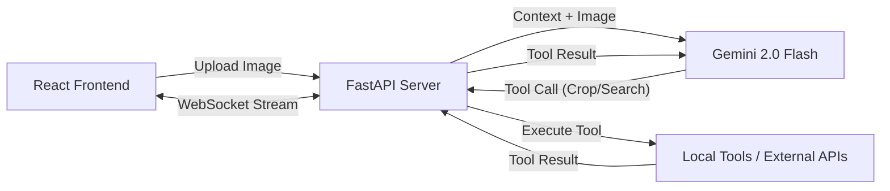

# Recon: Autonomous Visual Intelligence Agent


**Recon** is an autonomous AI agent capable of geolocalizing images with near-human accuracy. It moves beyond simple image-to-text processing by implementing an **Agentic Workflow**—it actively reasons, formulates hypotheses, and uses tools to verify its findings in real-time.

---

## 🚀 Key Features

*   **🧠 Chain-of-Thought Reasoning:** Utilizes the "Recon Method" to systematically break down images into visual clues (architecture, vegetation, street signs).
*   **🕵️ Autonomous Tool Use:**
    *   **Visual Zoom:** Automatically crops and "zooms in" on unreadable text or small details to get a better look.
    *   **Fact Verification:** Uses **Tavily Search API** to verify phone numbers, shop names, and landmarks before making a guess.
*   **⚡ Real-Time "Glass Box" UI:** A Cyberpunk-themed Terminal interface that streams the AI's internal monologue via WebSockets, so you can see exactly *what* it is thinking.
*   **🔍 Precision verification:** Fixes common AI hallucinations by scaling coordinates to the actual image resolution for pixel-perfect investigations.

---

## 🛠️ System Architecture

The system follows a **Client-Server** architecture designed for asynchronous communication.



*   **Backend:** Python (FastAPI, Uvicorn)
*   **Frontend:** React (Vite, TailwindCSS)
*   **AI Model:** Google Gemini 2.0 Flash (via `google-generativeai`)
*   **Tools:** Tavily Search API, Pillow (PIL)

---

## 📦 Installation

### Prerequisites
*   Python 3.10+
*   Node.js & npm
*   API Keys:
    *   **Google Gemini API Key** (for the brain)
    *   **Tavily API Key** (for web search)

### 1. Clone the Repository
```bash
git clone https://github.com/ananth-vardhan-cn/Recon.git
cd Recon
```

### 2. Backend Setup
```bash
# Create virtual environment
python -m venv .venv
source .venv/bin/activate  # On Windows: .venv\Scripts\activate

# Install dependencies
pip install fastapi uvicorn google-generativeai tavily-python python-dotenv pillow python-multipart websockets

# Configure Environment Variables
# Create a .env file in the root directory
echo "GEMINI_API_KEY=your_gemini_key_here" > .env
echo "TAVILY_API_KEY=your_tavily_key_here" >> .env
echo "MODEL_NAME=gemini-2.0-flash-exp" >> .env
```

### 3. Frontend Setup
```bash
cd frontend
npm install
```

---

## 🖥️ Usage

### 1. Start the Server
From the root directory:
```bash
# This runs the FastAPI backend on port 8000
uvicorn server:app --reload
```

### 2. Start the Client
Open a new terminal, navigate to `frontend`, and run:
```bash
cd frontend
npm run dev
```

### 3. Engage
Open your browser to the URL shown (usually `http://localhost:5173`).
1.  **Connect:** Ensure the system status shows "ONLINE".
2.  **Upload:** Drop an image into the target zone.
3.  **Engage:** Click "ENGAGE AGENT" and watch the investigation unfold.

---

## 🛡️ License

This project is open-source and available under the [MIT License](LICENSE).

---

> **Note:** This project serves as a portfolio demonstration of **Agentic AI Architecture** and **Full-Stack System Design**.
